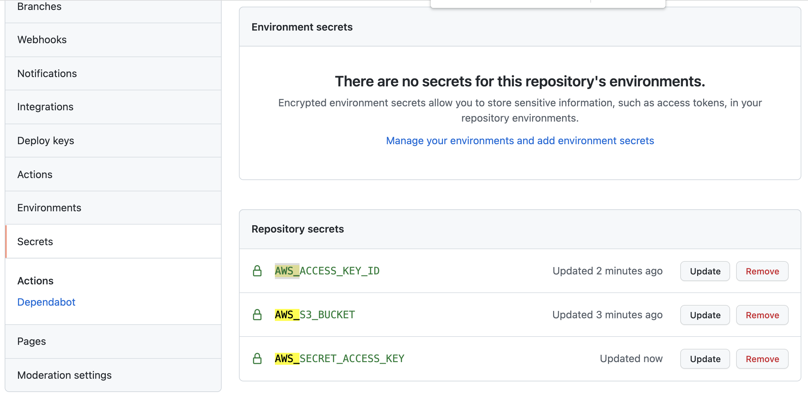

# aws-github-action-s3-reactjs 🐳


[](https://github.com/tquangdo/aws-github-action-s3-reactjs/issues/new)

## reference
[youtube](https://www.youtube.com/watch?v=HVw_NZUhDKs)

## Creating a new React project
```shell
cd aws-github-action-s3-reactjs
npx create-react-app .
```

## S3
- create bucketname=`dtq-bucket-bbucket-pline`
- Object Ownership=`ACLs enabled` & `Bucket owner preferred`
- permissions > Block all public access=`Off`
- Bucket policy=
```json
{
    "Version": "2012-10-17",
    "Statement": [
        {
            "Sid": "Statement1",
            "Effect": "Allow",
            "Principal": "*",
            "Action": [
                "s3:GetObject",
                "s3:PutObject"
            ],
            "Resource": "arn:aws:s3:::dtq-bucket-bbucket-pline/*"
        }
    ]
}
```

## Setting up a basic Github Actions workflow (install, build and test)
- create `.github/workflows/workflow.yml`
- github > `Settings` > `Secrets` > `New repository secret` > Add variables:
> https://github.com/tquangdo/aws-github-action-s3-reactjs/settings/secrets/actions/new

```shell
git add .
git commit -m 'cicd'
git push
```
- github > `Actions` > CICD's result is OK
- s3 > dtq-bucket-bbucket-pline > index.html > click `Object URL`
